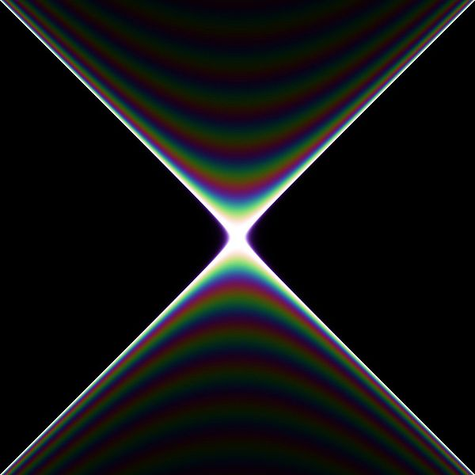

xquant 
=======

Relativity and quantum mechanics. Dependently-typed structures for physics in Idris.

_Feynman propagator with mass 20. [(Cyp)](https://commons.wikimedia.org/wiki/File:FeynmanPropagatorWithMass20.jpg)_

---

A set of Idris libraries for relativity and quantum physics, exploring library design for
physical computations in the presence of full dependent types.

Much of the functionality is not sufficiently performant for serious work, which could be addressed
by interfacing with another runtime. For now the library is to be considered a prototype.

Idris v0.19 at least is probably required.

---

_Notes on a few constituent modules._

#### Sigmas
Data types representing the quantum operators of the _n_-qubit state space, and functions on them, especially implementing their algebra.

#### SigKets
Data types for _n_-qubit state vectors, and functions involving both vectors and operators. In particular, we can calculate outcome probabilities and expectation values for any observables.

#### Gamma
Writing down a field theory for fermions requires a representation of the gamma matrix algebra. In even dimensions _(d = 2k + 2)_ this is a set of _d_ square matrixes with size _2^(k+1)_. The next odd-dimensional representation is formed by adding an additional matrix of the same size, corresponding to the product of all the others. We implement functions to recursively define gamma matrices of arbitrary dimension starting with _d = 2_. These numerical properties are enforced by the type system.

#### Marked
Data type `Marks` representing the number of ways to choose _n_ objects from a set of _m_, along with related functions and proofs. Used to make `ScalarGraph`s.

#### Feynman
Data type for correct-by-construction Feynman graph topologies with a fixed interaction order, i.e. a fixed number of line-endpoints connected to each vertex.

#### Helicity
Various constructions needed for the spinor helicity formalism for scattering amplitudes in quantum field theory.

#### Spectrum
Type-safe representations of quantum energy spectra and basis vectors, with cardinalities and degeneracies specified at the type level. Separate types for finite versus infinite dimensional systems.
